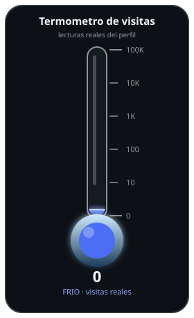
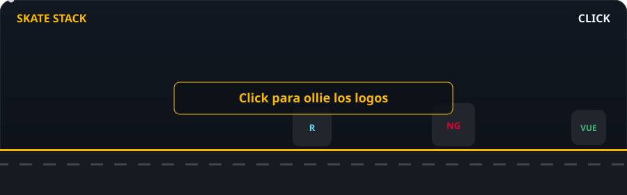

# Fake profile!!! I'm actually Julian Casablancas the lead singer of The Strokes and I use this profile to upload code.

  
  &nbsp;
  
  &nbsp;
  
  &nbsp;
  
  &nbsp;
  
  &nbsp;
  
  &nbsp;
  
  &nbsp;
  

  <b>TypeScript</b> · <b>JavaScript</b> · <b>Angular</b> · <b>Materialize</b> · <b>React</b> · <b>React Native</b> · <b>Ionic</b> · <b>Node.js</b>

---

## About me

> **Quisiera lokiar como ustedes pero yo ya abuse suficiente de la bida recia**

---

---

## Tech stack:

  

<b><a href="https://christiantrejoarr.github.io/christiantrejoarr/">▶ Jugar Skate Stack</a></b> — click en la pista para ollie sobre los logos.

<table>
  <tr>
    <td align="center" width="96">
       Sass
    </td>
    <td align="center" width="96">
       SCSS
    </td>
    <td align="center" width="96">
       CSS3
    </td>
    <td align="center" width="96">
       HTML5
    </td>
    <td align="center" width="96">
       JavaScript
    </td>
    <td align="center" width="96">
       TypeScript
    </td>
    <td align="center" width="96">
       Ionic
    </td>
    <td align="center" width="96">
       Angular
    </td>
  </tr>
  <tr>
    <td align="center" width="96">
       Bootstrap
    </td>
    <td align="center" width="96">
       Materialize
    </td>
    <td align="center" width="96">
       npm
    </td>
    <td align="center" width="96">
       React Router
    </td>
    <td align="center" width="96">
       React Native
    </td>
    <td align="center" width="96">
       React
    </td>
    <td align="center" width="96">
       Vue.js
    </td>
    <td align="center" width="96">
       Node.js
    </td>
  </tr>
  <tr>
    <td align="center" width="96">
       Yarn
    </td>
    <td align="center" width="96">
       MongoDB
    </td>
    <td align="center" width="96">
       Figma
    </td>
    <td align="center" width="96">
       Jira
    </td>
    <td align="center" width="96">
       Postman
    </td>
    <td align="center" width="96">
       WordPress
    </td>
    <td align="center" width="96"></td>
    <td align="center" width="96"></td>
  </tr>
</table>

---

## 📈 GitHub Activity Graph

<picture>
  <source media="(prefers-color-scheme: dark)" srcset="https://raw.githubusercontent.com/christiantrejoarr/christiantrejoarr/output/github-contribution-grid-snake-dark.svg"/>
  <source media="(prefers-color-scheme: light)" srcset="https://raw.githubusercontent.com/christiantrejoarr/christiantrejoarr/output/github-contribution-grid-snake.svg"/>
  
</picture>

