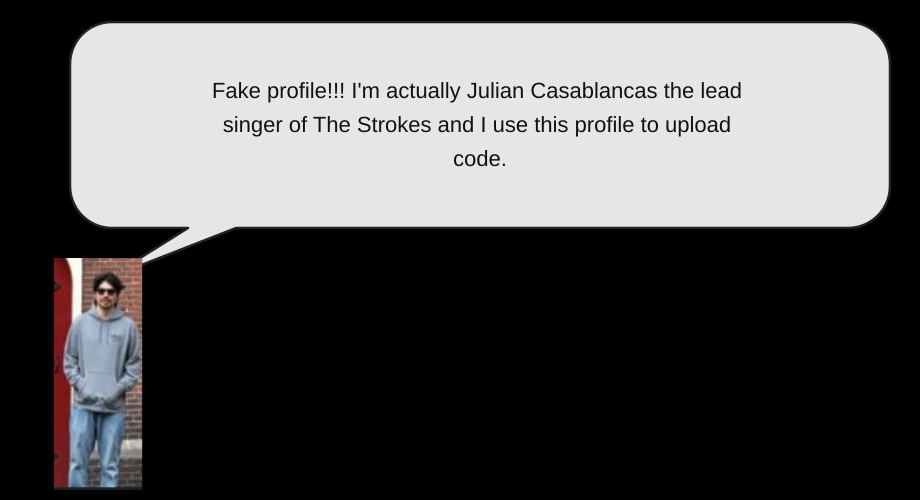

<table>
  <tr>
    <td valign="middle" width="180">
      
    </td>
    <td valign="middle" align="center">
      
<strong>How to reach me</strong>

      

        <object data="./assets/stack/linkedin.svg" type="image/svg+xml" width="96" height="118">
          
        </object>
      

      
<strong>Languages & Frameworks I code in</strong>

<table>
  <tr>
    <td align="center" width="96">
      <object data="./assets/stack/sass.svg" type="image/svg+xml" width="96" height="118">
        
      </object>
    </td>
    <td align="center" width="96">
      <object data="./assets/stack/scss.svg" type="image/svg+xml" width="96" height="118">
        
      </object>
    </td>
    <td align="center" width="96">
      <object data="./assets/stack/css3.svg" type="image/svg+xml" width="96" height="118">
        
      </object>
    </td>
    <td align="center" width="96">
      <object data="./assets/stack/html5.svg" type="image/svg+xml" width="96" height="118">
        
      </object>
    </td>
    <td align="center" width="96">
      <object data="./assets/stack/javascript.svg" type="image/svg+xml" width="96" height="118">
        
      </object>
    </td>
    <td align="center" width="96">
      <object data="./assets/stack/typescript.svg" type="image/svg+xml" width="96" height="118">
        
      </object>
    </td>
    <td align="center" width="96">
      <object data="./assets/stack/ionic.svg" type="image/svg+xml" width="96" height="118">
        
      </object>
    </td>
    <td align="center" width="96">
      <object data="./assets/stack/angular.svg" type="image/svg+xml" width="96" height="118">
        
      </object>
    </td>
  </tr>
  <tr>
    <td align="center" width="96">
      <object data="./assets/stack/bootstrap.svg" type="image/svg+xml" width="96" height="118">
        
      </object>
    </td>
    <td align="center" width="96">
      <object data="./assets/stack/materialize.svg" type="image/svg+xml" width="96" height="118">
        
      </object>
    </td>
    <td align="center" width="96">
      <object data="./assets/stack/npm.svg" type="image/svg+xml" width="96" height="118">
        
      </object>
    </td>
    <td align="center" width="96">
      <object data="./assets/stack/react-router.svg" type="image/svg+xml" width="96" height="118">
        
      </object>
    </td>
    <td align="center" width="96">
      <object data="./assets/stack/react-native.svg" type="image/svg+xml" width="96" height="118">
        
      </object>
    </td>
    <td align="center" width="96">
      <object data="./assets/stack/react.svg" type="image/svg+xml" width="96" height="118">
        
      </object>
    </td>
    <td align="center" width="96">
      <object data="./assets/stack/vuejs.svg" type="image/svg+xml" width="96" height="118">
        
      </object>
    </td>
    <td align="center" width="96">
      <object data="./assets/stack/nodejs.svg" type="image/svg+xml" width="96" height="118">
        
      </object>
    </td>
  </tr>
  <tr>
    <td align="center" width="96">
      <object data="./assets/stack/yarn.svg" type="image/svg+xml" width="96" height="118">
        
      </object>
    </td>
    <td align="center" width="96">
      <object data="./assets/stack/mongodb.svg" type="image/svg+xml" width="96" height="118">
        
      </object>
    </td>
    <td align="center" width="96">
      <object data="./assets/stack/figma.svg" type="image/svg+xml" width="96" height="118">
        
      </object>
    </td>
    <td align="center" width="96">
      <object data="./assets/stack/jira.svg" type="image/svg+xml" width="96" height="118">
        
      </object>
    </td>
    <td align="center" width="96">
      <object data="./assets/stack/postman.svg" type="image/svg+xml" width="96" height="118">
        
      </object>
    </td>
    <td align="center" width="96">
      <object data="./assets/stack/wordpress.svg" type="image/svg+xml" width="96" height="118">
        
      </object>
    </td>
    <td align="center" width="96"></td>
    <td align="center" width="96"></td>
  </tr>
</table>

    </td>
  </tr>
</table>

<strong>My contributions</strong>

